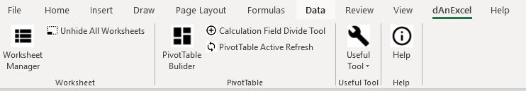

# dAnExcel

##### This project is to reduce manual effort on data handling task in excel. I will try to continue work on more useful function and to consolidate all codes to a comprehensive add-in.

- Excel addin for handling repeated daily operation task on worksheet and pivot table

## A.Worksheet Function (developing)

- Manager : include rename, hide and unhide
- Unhide all worksheets at one time

## B.Pivot Table Function (bug fixing)

-Builder : include quick add & remove, summarize & formatting   
   

-Calculation Divide Tool : Quick create calculation field by many fields divided by one field  
  

- Manager : Quick refresh active workbook

## C.Useful Tool List (adding)

- Password breaker (unstable)  
  - To break password protected worksheet (wait about 10 -15 seconds)  
- Range A1
  - To set range A1 all worksheets  

## Coming Feature:

- Chart auto-create with style
